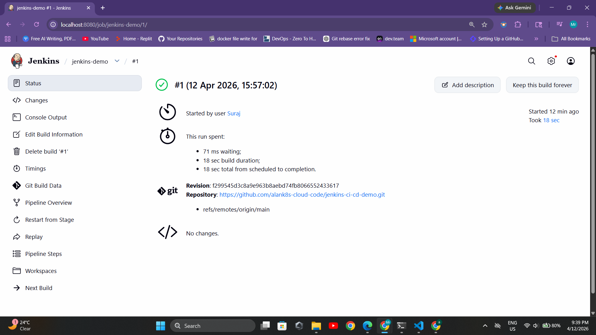
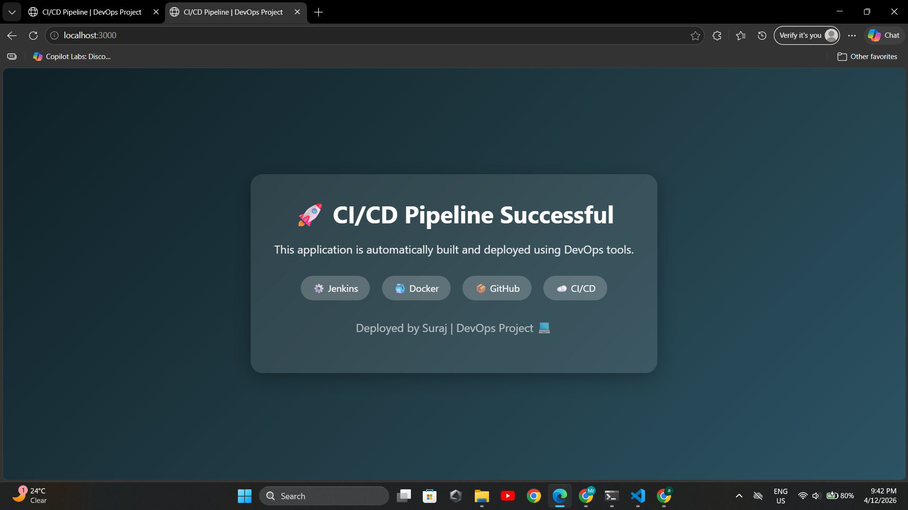

# 🚀 Jenkins CI/CD Pipeline (Beginner Guide)

## 📌 What I Learned today

In this project, I learned something new about how applications can be built and deployed automatically using Jenkins and Docker.
I understood how CI/CD works in a simple and practical way, and how code changes can be turned into a running application without doing everything manually.

---

## 📌 Project Overview

This project shows how to build and deploy a simple Node.js web application using Jenkins and Docker.
The goal is to understand how CI/CD works in a simple and practical way.

---

## 🛠 Tools Used

* Jenkins
* Docker
* Git & GitHub

---
## 📂 Project Structure

```bash id="a9qk2
jenkins-ci-cd-demo/
├── asset/
│   └── output/
├── public/
├── Dockerfile
├── Jenkinsfile
├── README.md
├── app.js
└── package.json
```
## ⚙️ Prerequisites

Make sure you have:

* Jenkins installed and running
* Docker installed
* Git installed

---

## 🔧 Step 1: Give Docker Access to Jenkins

```bash
sudo usermod -aG docker jenkins
sudo systemctl restart jenkins
```

---

## 🔧 Step 2: Create a New Pipeline in Jenkins

1. Open Jenkins in browser → `http://localhost:8080`
2. Click **New Item**
3. Enter name → `jenkins-demo`
4. Select **Pipeline**
5. Click OK

---

## 🔧 Step 3: Connect Jenkins with GitHub Repository

1. Go to Pipeline section
2. Select **Pipeline script from SCM**
3. Choose **Git**
4. Enter repository URL:

   ```
   https://github.com/alank8s-cloud-code/jenkins-ci-cd-demo.git
   ```
5. Set branch:

   ```
   main
   ```
6. Script path:

   ```
   Jenkinsfile
   ```
7. Click **Save**

---

## 🔧 Step 4: Run the Pipeline

Click **Build Now** in Jenkins.

---

## 🔧 Step 5: Check Pipeline Execution

* Open the build
* Click **Console Output**
* Verify that all stages run successfully

---

## 🔧 Step 6: Access the Application

After successful build, open:

```
http://localhost:3000
```

---

## 🔧 Step 7: Test CI/CD Flow

1. Make a small change in your project
2. Push code to GitHub
3. Run the pipeline again in Jenkins

---

## Initial Pipeline Successful Run

This shows the pipeline successful running:



Step 1: Check running container

docker ps
---

## 🌍 Live Application

Access in browser:



Step 1: Open web application

http://localhost:3000
---

## 🎯 Result

* Jenkins pipeline runs successfully
* Application is built and deployed automatically
* Basic CI/CD process is working

---

## ❓ Why Jenkins and GitHub Actions Are Different

Jenkins and GitHub Actions both do CI/CD, but they work in different ways.
Jenkins is a self-managed tool where we install and configure everything manually, which helps in understanding how pipelines work internally.
GitHub Actions is a cloud-based service that runs directly from GitHub, where most setup is already handled.
That is why both approaches feel different, even though the goal is the same.

---
